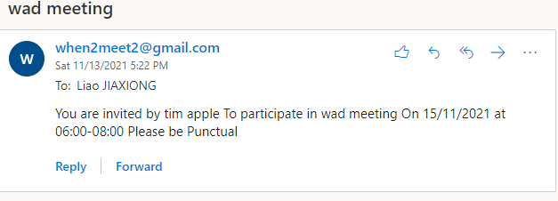

[](https://classroom.github.com/online_ide?assignment_repo_id=453520&assignment_repo_type=GroupAssignmentRepo)
# :wave: is216-project


## 🚀 IS216 - Group 21- Little Piglets
* members:
    -  Wisely Kwek | wisely.kwek@scis.smu.edu.sg
    -  Liao Jia Xiong | jxliao.2020@scis.smu.edu.sg
    -  Valerie Woon Rui Fang | valeriewoon.2020@scis.smu.edu.sg
    -  Yang Xin Yue | xinyue.yang.2020@scis.smu.edu.sg
    -  Chua Su-Ann, Natalie | sachua.2020@scis.smu.edu.sg


## 🔎 Project Overview ##
<!-- * Describe your project. What is it called? What does it do? Why did you make this web application? Who will benefit from using your web application? Describe your users - who are they? (anyone? or specific target age group or gender? region? country?)
# * Feel free to use diagrams and images to describe. For example, if you have a system architecture diagram, please place it here and describe it. If you have a business process diagram, you can also place it here and describe it.
-->
* Our project is When2Meet2, an improved version of the current When2Meet.
* In When2Meet2, users will create their own account where they can indicate their weekly schedule. Users will also have a freind list where they can add their friends and be able to view any upcoming meetings that they have scheduled.
* When creating a meeting, the user simply inputs the details of the meeting such as the date, the time frame, and the members that the user wants to have a meeting with.
* The application will send an email reminder to the participants of the meeting and update the user's upcoming meeting list which can be viewed in the upcoming evnets page of When2Meet2. 


## 👨 Target Audience ##
* Our project mainly targets students (uni/poly/jc) who have routine time table. 
* As everyone has different weekly schedules, it can be difficult for project groups or groups of friends to find a time where everyone is available to have a meeting or catch up. Therefore, with When2Meet2 we aim to simplify this process and make it easier to see everyone's availability and coordinate meetings.


## ✏️ Navigation Diagram ##


## 💻 How to Install and Run Our Web Application (for Developers) ##
<!-- * If a new developer were to have access to your IS216 project GitHub repo (and subsequently your source code files) and replicate your development environment on his development laptop computer, what are the steps he should take?
* What does he needs to install on his development laptop computer? How can he download your project files and run it on his own computer?
* Provide a step-by-step description of how to get the development environment running. You can choose to do so for at least 1 Operating System (Windows 10 or Mac OS).
* Feel free to use diagrams and images to describe.
-->
* Unzip the submitted zip file in the root of folder of your WAMP/MAMP server (www folder if using WAMP, htdocs if using MAMP)
* Open up the file auth_login.html 

## 🕜 Data Structure to Make Our Time Table Possible ##
* To make our website display the user's time table dynamically, we tried many variations of data structure from strings to arrays and to many complex structures.\
* We finally finalized the easiest way to store our time table which is presented in the table below
```
        time_slot:[
        [0,0,0,0,0,0,0,0,0,0,0,0,0,0,0,0,0,0,0,0,0,0,0,0],
        [0,0,0,0,0,0,0,0,0,0,0,0,0,0,0,0,0,0,0,0,0,0,0,0],
        [0,0,0,0,0,0,0,0,0,0,0,0,0,0,0,0,0,0,0,0,0,0,0,0],
        [0,0,0,0,0,0,0,0,0,0,0,0,0,0,0,0,0,0,0,0,0,0,0,0],
        [0,0,0,0,0,0,0,0,0,0,0,0,0,0,0,0,0,0,0,0,0,0,0,0],
        [0,0,0,0,0,0,0,0,0,0,0,0,0,0,0,0,0,0,0,0,0,0,0,0],
        [0,0,0,0,0,0,0,0,0,0,0,0,0,0,0,0,0,0,0,0,0,0,0,0]
        ],
```
* There are 24 hours in a a day and there are 7 days in a week. The first row represents Sunday and second row represents Monday and so on. 0 represents unavailable and 1 represents available. When multiple time tables stack together we just have to add up thier binary representation of availability according to thier `day_index` and `time_index`. 

## ✅ Display different person's availability ##
* In when2meet.com when ever you hover a timeslot a pop up page will display who is available on that time slot and who is not available on that timeslot. We felt that this user interface is very crucial for our users and hence we also want to implement such a function.
* However, our current data structure only stores numbers and hence we need new ways to display such function. 
```
    compounded_string_time_slot : [
        [[],[],[],[],[],[],[],[],[],[],[],[],[],[],[],[],[],[],[],[],[],[],[],[]],
        [[],[],[],[],[],[],[],[],[],[],[],[],[],[],[],[],[],[],[],[],[],[],[],[]],
        [[],[],[],[],[],[],[],[],[],[],[],[],[],[],[],[],[],[],[],[],[],[],[],[]],
        [[],[],[],[],[],[],[],[],[],[],[],[],[],[],[],[],[],[],[],[],[],[],[],[]],
        [[],[],[],[],[],[],[],[],[],[],[],[],[],[],[],[],[],[],[],[],[],[],[],[]],
        [[],[],[],[],[],[],[],[],[],[],[],[],[],[],[],[],[],[],[],[],[],[],[],[]],
        [[],[],[],[],[],[],[],[],[],[],[],[],[],[],[],[],[],[],[],[],[],[],[],[]]
    ],
    not_avail_time_slot : [
        [[],[],[],[],[],[],[],[],[],[],[],[],[],[],[],[],[],[],[],[],[],[],[],[]],
        [[],[],[],[],[],[],[],[],[],[],[],[],[],[],[],[],[],[],[],[],[],[],[],[]],
        [[],[],[],[],[],[],[],[],[],[],[],[],[],[],[],[],[],[],[],[],[],[],[],[]],
        [[],[],[],[],[],[],[],[],[],[],[],[],[],[],[],[],[],[],[],[],[],[],[],[]],
        [[],[],[],[],[],[],[],[],[],[],[],[],[],[],[],[],[],[],[],[],[],[],[],[]],
        [[],[],[],[],[],[],[],[],[],[],[],[],[],[],[],[],[],[],[],[],[],[],[],[]],
        [[],[],[],[],[],[],[],[],[],[],[],[],[],[],[],[],[],[],[],[],[],[],[],[]]
    ],
```
* We implemented new data structures so that this function is possible . We used a multi nested list instead of adding their binary availability, we add their name in.
* If the user add a user in `make_a_meeting.html` if availability = 0 then his name will be added to the `not_avail_time_slot` array if its = 1 then his name will be added to the `compounded_string_time_slot`. A hover event is added to each time slot and will display using thier `day_index` and `time_index` by integrating it with a vue function coupled with DOM.


The image above is the result. 

## 📡 Firebase and email API ##
In order to integrate our application with the Firebase platform, we created a REST API using Express with Firebase Cloud Functions, Javascript, and Firestore that has create, read, and update functionality. 

To get started with the API, you will need to have Node.js installed on your computer. After installing Node.js, you will need to run the following command in your terminal to install the Firebase CLI. 

```
npm install -g firebase-tools
```
To make changes from the index.js file, run the command below.

```
firebase deploy --only functions
```
To send email, We used the SmptpJS API.
* connect  to thier CDN
* Use thier template code
```
<script src="https://smtpjs.com/v3/smtp.js"></script>

Email.send({
    Host : "smtp.yourisp.com",
    Username : "username",
    Password : "password",
    To : 'them@website.com',
    From : "you@isp.com",
    Subject : "This is the subject",
    Body : "And this is the body"
}).then(
  message => alert(message)
);
```
The result is shown below \
All meeting details will be sent dynamically to the members and the user do not have to do this by them self
* No manual reminder
* At a click of a button

\


## 💻 localStorage ##
* Upon successful login, the Firebase console will send a user token containing the user's id or `uid` which is cached in localStorage under the key `user_id`. When rendering my_availability page, we utilise the Firebase REST API to make a get request and retrieve the current user's information as a JSON object from the Firestore. This information is then cached as a string using `JSON.stringify(userObj)` in localStorage under the key `user_info`.
* For my_availability page, the users available_time_slot is retrieved using `JSON.parse(localStorage['user_info'])` from local storage and rendered. Whenever the user's uvailability is updated, avalable_time_slots in the userObj in localStorage is automatically updated.


## 📝 How to Use Our Web Application (for Visitors to our Website) ##
<!-- * Yay! Your website is READY for visitors!
* Provide a step-by-step description of what the user/visitor can/should do upon visiting your website for the first time.
* It would be wonderful if you could include **screenshot images** of web pages to demonsrate what the user/visitor can/should do. -->

### 1. Sign up via the sign up page ###

* If it is the user's first time visiting the site, they will need to create an account. Simply input the desired username, email, name and password and agree to the terms and conditions.
* After filling up the input fields, click sign up and an alert window should appear notifying the user of a successful account creation. After this the user can head back over to the login page to login with their account credentials.


### 2. Log in via the login page ###
* Once the user sucessfully logs in, they will be brought to the My Availability page.


### 3. Input your own availability in your My Availability page ###
* The My Availability page shows time slots for each hour of the day for each day of the week. If the user just registered an account, all the time slots will show unavailable and the user will have to click on each time slot to indicate their availability for the week.
* After the user is done indicating their time slots, they need to click the `update availability` button at the bottom of the page to update thair availability.


### 4. Find your friends by searching for their usernames ###
* User can add friends at the my friends page. The user can search for friends in the search bar and add them to their friend list. 


### 5. Schedule a meeting by adding friends ###
* When the user wishes to schedule a meeting, he can head over to the make a meeting page where he will be able to input the name of the meeting, the desired starting day, the desired time limit.
* After filling in the first few input fields, the user can press set and a time table for the week of the desired starting day and the desired time slot will appear on the right of the page.
* The user can have the option of selecting some of the members of his friend list for the meeting. When each member is added, their respective availabilities are mapped onto the time table on the right of the screen where the user (admin) is able to see the number of people available for each time slot.
* Hovering over each time slot, the admin will be able to see a pop up window indicating who is available and who is not available.
* The admin will then select a desired time slot 
* The admin will click the send invite button and an email regarding the meeting is sent to the different members involved in the meeting.


### 6. Viewing upcoming meetings ###
* After setting a meeting, the user can also view the meetings that he has set in the upcoming meetings page, which displays the meetings for each date, the name of the meeting and the time the meeting is going to take place.


## 💡 Figma Link ##
* Initial Prototype:
https://www.figma.com/file/edIvK9nGUJOiEqklyrTZLm/When2Meet2-Initial-Prototype?node-id=0%3A1


* Final Prototype:
https://www.figma.com/file/BnLryhqjH8Pte9wNnAD1Cp/When2Meet-2.0-Prototype?node-id=0%3A1


## 🤓 Other Things ##
* FEEL FREE to **add more things** into this **README**


## Acknowledgements ##

* Flaticon 
* Prof Kyong for the giving us the directions as to how go about the prototype
* Our members who work really hard to make this website possible

## 🤓 Useful Resources ##
* [**Markdown** Cheat Sheet](https://www.markdownguide.org/cheat-sheet/)
* [**GOOD** README Example 1](https://github.com/testing-library/cypress-testing-library)
* [**GOOD** README Example 2](https://github.com/typeorm/typeorm)
* [**GOOD** README Example 3](https://github.com/amark/gun)
* [**GOOD** README Example 4](https://github.com/google/leveldb)
